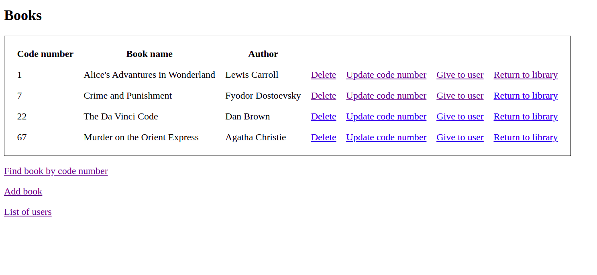
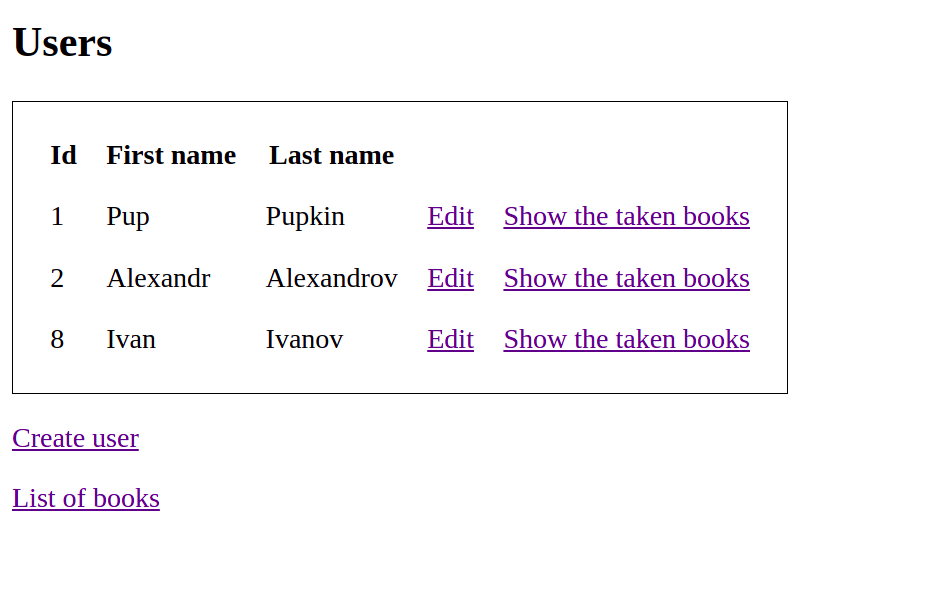

# Library #

### Программа для работников библиотеки. ###


 В базе данных хранятся сведения об имеющихся в библиотеке книгах и о читателях библиотеки. 
   
 

#### Библиотекарю доступны следующие сведения: #### 
* какие книги закреплены за читателем
* кто автор и как называется книга с заданным шифром

#### Библиотекарь может вносить следующие изменения:  ####
* запись нового читателя в библиотеку
* пополнение библиотеки
* списание старой книги
* изменение шифра книги  

### Запуск приложения. ###
В файл src/main/resources/application.properties необходимо дописать свои настройки для БД.
```bash
./mvnw spring-boot:run
```
#### Вам понадобится установить: ####
* Spring Boot
* MySql
* Maven


